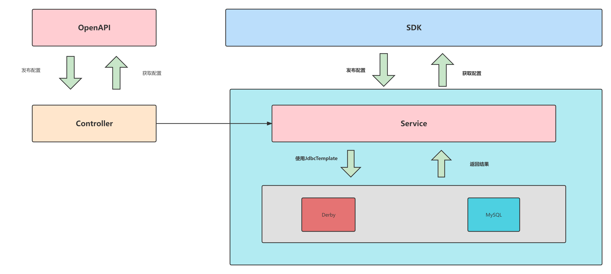
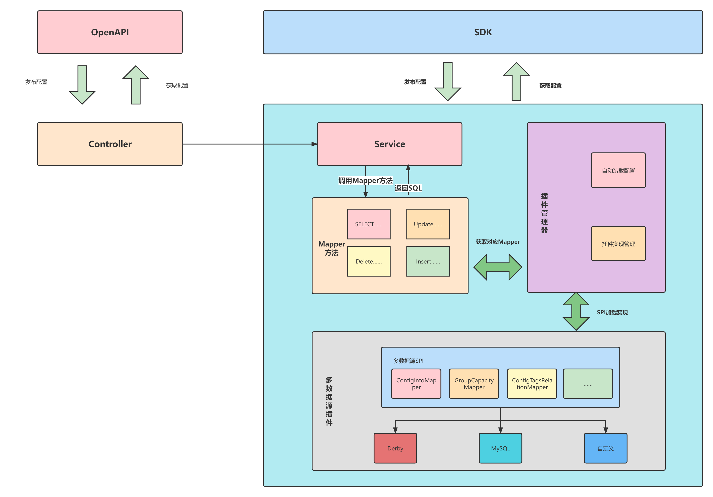

# Multi-data-plugin
From the 2.2.0 version, Nacos can inject the plugin of the multi-data source through the SPI mechanism, and after the introduction of the corresponding data source implementation, Nacos will read the `spring.datasource.platform` parameter in the `application.properties` configuration file to load the corresponding plugins implementation when the nacos startup. This document introduces in detail how to achieve a multi-data source plugin and how to take effect.

> Note:
> At present, the multi-data-source-plugin is in the BETA test stage. The definition of the API and interface method may be upgraded in the subsequent version and has a large modification. Please note that your plugin version is applicable.

# Plug-in implementation
In the original Config module, the execution of all SQL operations is to execute the fixed SQL statement by using JdbcTemplate directly, so that the SQL statement and service logic are high coupling, and only the two data sources of Derby and MySQL. 
The original Config module architecture is as follows.

Now the multiple-source-plugin is loaded through the SPI mechanism, and disassemble the SQL operation into multiple mappers according to the table name, the implementation class of the Mapper interface needs to be implemented according to different data sources to implement the corresponding SQL dialect implementation
The plugin provides MAPPER implementation of Derby and MySQL, which can be used directly; other data sources require users to load the data source plugin implementation.

# How to use
1. The user querys whether the current Nacos supports the required data source, Nacos provides the implementation of Derby and MySQL by default.
2. In the `application.properties` configuration file, modify the `spring.datasource.platform` parameter to the corresponding data source name, and configure the data source related parameters;
3. Then compile and run, you can support this data source;

# How to develop the multi-data-plugin
1. Introduce `nacos-datasource-plugin` dependencies
2. Implementing the special SQL method in the Mapper interface in the `com.alibaba.nacos.plugin.datasource.mapper` package to implement the MAPPER interface is mainly involved in dialect differences such as paging. For reference to the implementation of Derby and MySQL under `com.alibaba.nacos.plugin.datasource.impl`, you only need to implement the corresponding interface. The corresponding relationship between the interface and the table is as follows:

    | Database Table Name     | Mapper|
    | ----------- | ----------- |
    |config_info_aggr| ConfigInfoAggrMapper      |
    |config_info_beta| ConfigInfoBetaMapper        |
    |config_info|ConfigInfoMapper|
    |config_info_tag|ConfigInfoTagMapper|
    |config_tags_relation|ConfigTagsRelationMapper|
    |his_config_info|HistoryConfigInfoMapper|

3. Write the SPI configuration file, the name is `com.alibaba.nacos.plugin.datasource.mapper.mapper`. The class that implements the Mapper interface can refer to the derby and MySQL configuration file in the config module.
4. Plugin users can rely on this plugin to achieve the effect of realizing the corresponding data source operation
5. Compile and run

# How to compile
You need to compile `nacos` and install to your local repository,before all the things.
1. git clone git@github.com:alibaba/nacos.git
2. cd nacos && mvn -B clean package install -Dmaven.test.skip=true

> if during this time occur an error that maven can't resolve `${revision}`, you may need to update maven version to latest.

3. git clone #{The git address of multi-data-source-plugin implementation}
4. mvn install

Done, enjoy it!

Suggestion: upload to your company repository if you can

# Future plans
The future version is updated as follows:
- [ ] Continue to subdivide SQL. On the basis of existing, while reducing the SQL statement, the implementation of dynamic SQL is more friendly;
- [ ] Dive the list of differences between different data sources, and replace the differential list through the configuration file or configuration class, which is convenient for plugin writers to write plugin implementation;

# Implementation of other data sources
To be supplemented